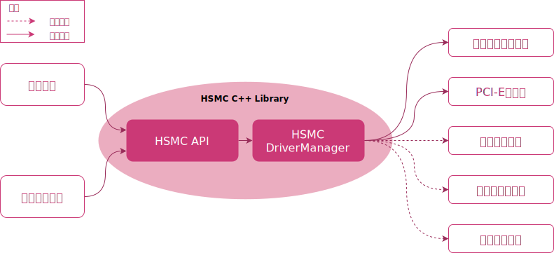

# 概述

`HSMC`是一个以C++语言封装的开发库（C++ Headers & Library）。面向需要进行国密改造的业务系统，为其提供异构厂商的密码设备调用能力。业务系统应用程序动态或静态链接HSMC库可实现对底层包括服务器密码机、签名验签服务器、时间戳服务器等设备算力的统一访问。

您可以访问[HSMC官方网站](https://hsmc.idslab.io) 了解更多信息。

## 架构




`HSMC`为应用程序或密码工具套件提供统一的`HSMC API`接口，通过`HSMC`库对底层异构密码设备的管理和调度，实现上层应用或密码工具对底层设备的透明访问。

在业务实际开发阶段，可借助自带的`密码机软件模拟器`提供的SDF接口库，实现业务开发测试闭环。在需要满足密评合规的场景下，无需更改业务代码，仅通过变更`HSMC`配置，即可实现密评合规的无缝迁移。


## 开发

`HSMC`使用cmake进行编译

### 第三方依赖

`HSMC`依赖的三方库包括：
- [`google abseil c++`](https://github.com/abseil/abseil-cpp)开发库
- [`spdlog`](https://github.com/gabime/spdlog)开发库用于日志记录
- [`yaml-cpp`](https://github.com/jbeder/yaml-cpp)开发库用于配置文件解析
- [`opentelemetry-cpp`](https://github.com/open-telemetry/opentelemetry-cpp)用于密码设备SDF等调用的性能监控。*可选*

如果编译单元测试，则需要依赖以下库：
- [`gtest`](https://github.com/google/googletest)单元测试库

### 编译&安装
请准备好cmake编译环境以及以上依赖后，可执行：
```shell showLineNumbers
mkdir build
cd build
cmake ..
make -j
make install
```
可根据编译需要，开启或关闭
- `HSMC_BUILD_WITH_OPENTELEMETRY`, 启用SDF性能监控（可通过prometheus监控SDF相关metric）


## 集成示例

```c
#include <iostream>
#include <hsmc/hsmc.h>

int main(int argc, char **argv) {
    if (argc < 2) {
        return -1;
    }

    // load configuration from yaml file
    hsmc::SessionFactory factory;
    factory.init(argv[1]);

    // create session pool and fetch a session
    hsmc::SessionPool pool(factory);
    auto session = pool.get();

    int kekIndex = 1;
    unsigned char dek[32] = {0};
    unsigned int deklen = 32;
    void *keyHandle = nullptr;

    // generate dek
    session.SDF_GenerateKeyWithKEK(128, SGD_SM4_ECB, kekIndex, dek,
                                   &deklen, &keyHandle);

    unsigned char plaintext[16] = "hello world!";
    unsigned char ciphertext[32] = {0};
    unsigned int ciphertextlen = sizeof(ciphertext);

    // encrypt plaintext with dek
    session.SDF_Encrypt(keyHandle, SGD_SM4_ECB, nullptr, plaintext,
                        sizeof(plaintext), ciphertext, &ciphertextlen);

    // destroy dek
    session.SDF_DestroyKey(keyHandle);
    keyHandle = nullptr;

    // import dek and the key handle returned
    session.SDF_ImportKeyWithKEK(SGD_SM4_ECB, kekIndex, dek,
                                 deklen, &keyHandle);

    unsigned char decrypttext[16] = {0};
    unsigned int decrypttextlen = sizeof(decrypttext);

    // decrypt ciphertext with the imported dek
    session.SDF_Decrypt(keyHandle, SGD_SM4_ECB, nullptr, ciphertext,
                        ciphertextlen, decrypttext, &decrypttextlen);

    if (memcmp(plaintext, decrypttext, sizeof(plaintext)) == 0) {
        std::cout << "SM4 ECB encrypt/decrypt success" << std::endl;
    } else {
        std::cout << "SM4 ECB encrypt/decrypt failed" << std::endl;
    }

    return 0;
}

```
更多使用方式，可以参考`test`中的单元测试示例

## License
`HSMC` is released under the Apache License 2.0 License.